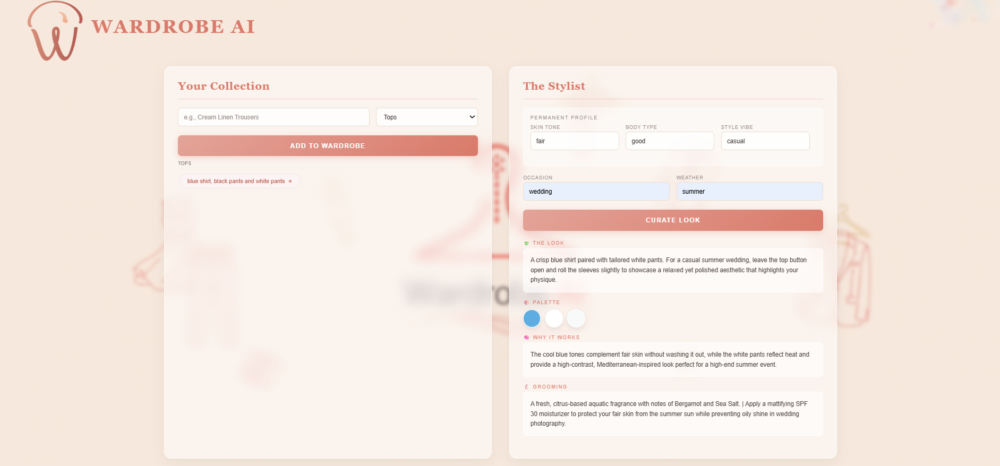

# Wardrobe AI 

I built this because I realized I spend way too much time staring at my closet every morning. It’s a simple web app that uses the Google Gemini API to act as a personal stylist. Instead of just giving you random fashion advice, it actually looks at the specific clothes you own and suggests an outfit based on the vibe you're going for and the weather outside.

### What’s going on under the hood?
* **The Backend:** I kept it simple with Python and Flask. I used a JSON file to store the "wardrobe" so the data actually stays there when you refresh the page.
* **The AI Part:** This was the fun part. I had to experiment a lot with the prompts to get Gemini to stop acting like a generic chatbot and start acting like a stylist. It now takes skin tone and body type into account to give advice that actually makes sense.
* **The UI (My favorite part):** I didn't want this to look like a basic school project. I went for a "Glassmorphism" look—frosted panels over a blurred background. It took forever to get the transparency and the blur levels to look "premium" without making the text hard to read.

### Challenges I faced
Getting the background image to blend perfectly with the UI was a headache. I ended up using a mix of CSS filters and backdrop-blurs to get that high-end boutique feel. I also had to figure out how to securely handle API keys so they don't just sit in the code for everyone to see.

## 📸 Project Preview

### What's next?
I really want to add a feature where you can just take a picture of your shirt and the AI automatically tags the color and fabric. For now, typing it in works, but the "camera" feature is definitely the goal.

---
**Tech used:** Python (Flask), JavaScript, CSS3 (Advanced Glassmorphism), Google Gemini API.
